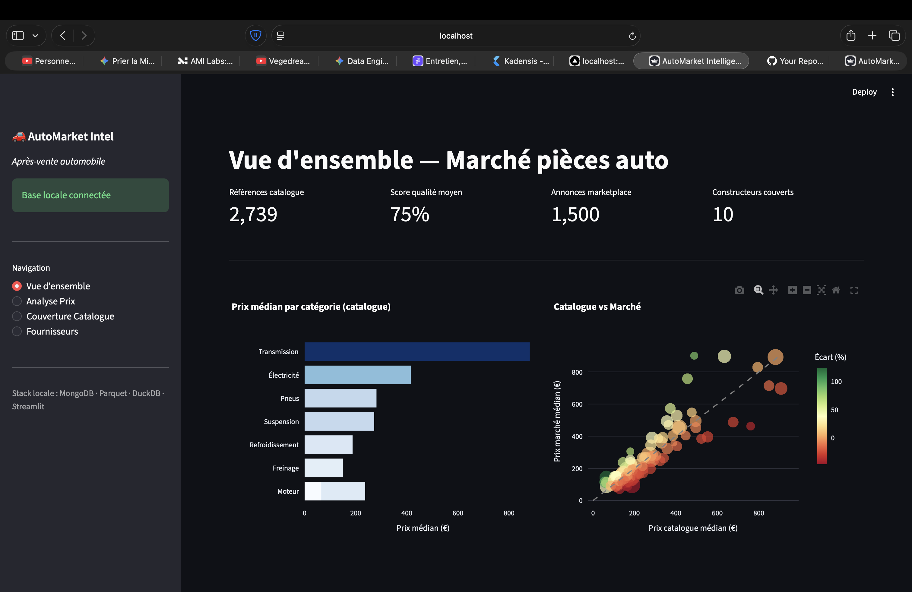
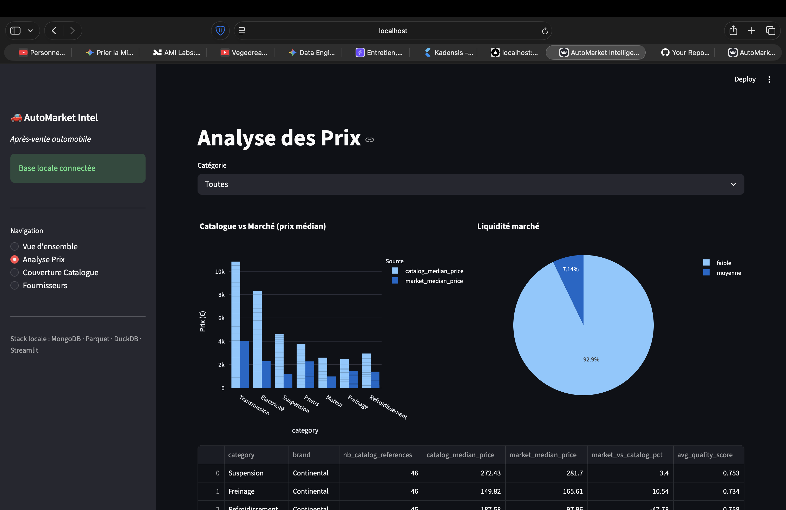
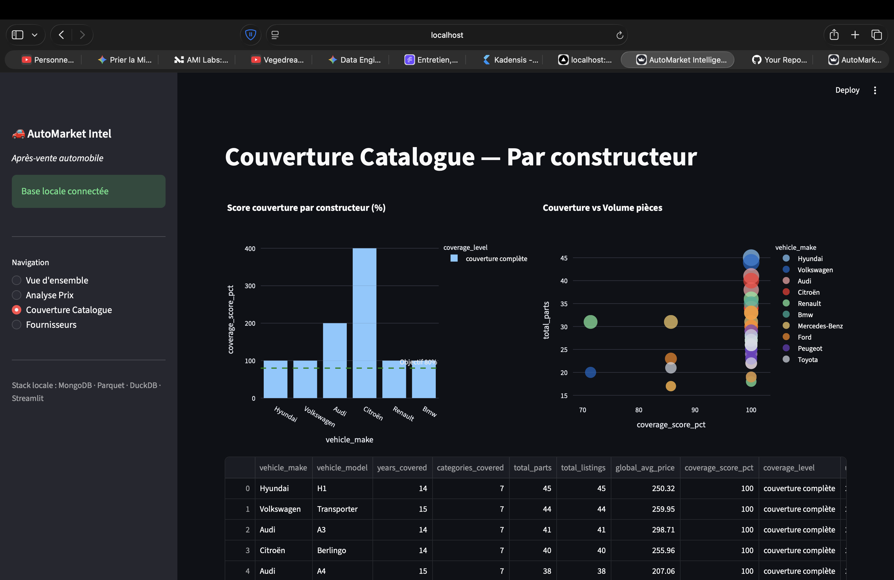
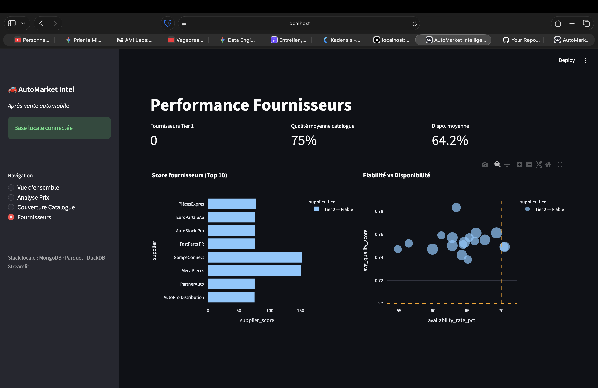

# AutoMarket Data Platform




Pipeline data end-to-end pour l'analyse du marché après-vente automobile.  
Couvre l'intégralité du cycle de vie de la donnée : ingestion → lake → transformation → analytics.

---

## Architecture

```
[Sources]
  ├── NHTSA API          — rappels véhicules (données réelles)
  ├── Parts Catalog      — catalogue pièces multi-sources
  └── Market Listings    — annonces marketplace
         ↓
[MongoDB]          Raw Landing Zone — schéma flexible, ingestion rapide
         ↓ Airflow DAG 01
[Bronze]           Parquet brut partitionné par date
         ↓ Airflow DAG 02 + DAG 03
[Silver]           Parquet nettoyé, dédupliqué, typé
         ↓ Airflow DAG 04
[Gold]             Marts analytiques DuckDB — prêts à consommer
         ↓
[Streamlit]        Dashboard KPIs marché auto
```

## Stack technique

| Couche | Technologie |
|---|---|
| Ingestion | Python, pymongo |
| Raw storage | MongoDB 7.0 |
| Stockage fichiers | Parquet (local) → AWS S3 (prod) |
| Traitement | Pandas (local) → PySpark 3.5 (prod) |
| Orchestration | Apache Airflow 2.9 |
| Analytique | DuckDB (local) → dbt + Athena (prod) |
| Infrastructure | Terraform (AWS S3, IAM, Glue) |
| Dashboard | Streamlit + Plotly |

## Screenshots

| Vue d'ensemble | Analyse Prix |
|---|---|
|  |  |

| Couverture Catalogue | Performance Fournisseurs |
|---|---|
|  |  |

---

## Use cases métier

**Analyse pricing** — Prix médian par catégorie, écart catalogue vs marché, détection outliers IQR

**Couverture catalogue** — Score de couverture par constructeur/modèle (logique Parts.IO)

**Performance fournisseurs** — Tiering Tier 1→4, fiabilité × disponibilité × cohérence prix

**Impact rappels** — Croisement rappels NHTSA × disponibilité pièces catalogue

## Démarrage rapide

### Prérequis
- Python 3.11+
- Docker Desktop

### Installation

```bash
make install
```

### Lancer le pipeline complet

```bash
make run
```

Dashboard disponible sur [http://localhost:8501](http://localhost:8501)

### Commandes disponibles

```bash
make install    # Créer le venv et installer les dépendances
make run        # Stack complète : MongoDB + pipeline + dashboard
make pipeline   # Rejouer uniquement les transformations
make dashboard  # Lancer uniquement le dashboard
make stop       # Arrêter MongoDB
make clean      # Supprimer les données générées
```

## Structure du projet

```
automarket-data-platform/
├── ingestion/
│   ├── connectors/
│   │   ├── nhtsa_connector.py          # API NHTSA (rappels réels)
│   │   └── synthetic_parts_generator.py
│   └── mongo_loader.py                 # Raw landing → MongoDB
├── airflow/dags/
│   ├── 01_ingest_to_mongo_dag.py
│   ├── 02_mongo_to_bronze_dag.py
│   ├── 03_bronze_to_silver_dag.py
│   └── 04_silver_to_gold_dag.py
├── spark_jobs/                         # PySpark (déploiement prod AWS)
│   ├── mongo_to_s3_export.py
│   └── bronze_to_silver.py
├── dbt/                                # Modèles analytiques (prod AWS)
│   └── models/
│       ├── staging/
│       ├── intermediate/
│       └── marts/
├── terraform/                          # IaC AWS (prod)
│   ├── s3.tf
│   ├── iam.tf
│   └── glue.tf
├── dashboard/
│   └── app.py
├── scripts/
│   └── run_pipeline_local.py           # Pipeline local complet
├── docker-compose.yml
├── requirements.txt
└── Makefile
```

## Déploiement production (AWS)

Les fichiers Terraform, PySpark et dbt sont inclus pour le passage en production :

```bash
cd terraform
terraform init
terraform apply -var="use_localstack=false"
```

Adapter ensuite le profil `prod` dans `dbt/profiles.yml` (Athena ou Redshift Spectrum).
